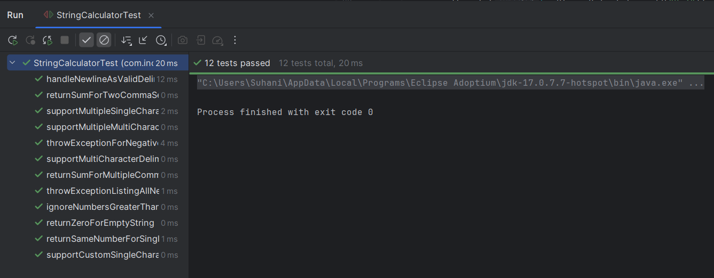

# 🧪 Incubyte TDD Assessment - String Calculator Kata

Welcome! This repository contains my implementation of the **String Calculator Kata** using a pure **Test-Driven Development (TDD)** approach — following the principles of clean code, maintainability, and continuous improvement.

---

## ⚙️ How to Run

To run the tests, use the following Maven command:

```bash
mvn test
```

---

## 🔁 Red-Green-Refactor Cycle (3 Laws of TDD in Action)

This implementation follows the **Three Laws of TDD**:

1️⃣ You may not write **production code** unless you have first written a **failing test**.  
2️⃣ You may not write more of a **test** than is sufficient to **fail**.  
3️⃣ You may not write more **production code** than is sufficient to **pass the test**.

---

## 🚀 Testcases Covered

✅ Returns 0 for empty input  
✅ Handles one or more numbers separated by commas  
✅ Supports `\n` as a valid delimiter  
✅ Supports custom single-character delimiters via `//;\n1;2`  
✅ Throws exception for negative numbers  
✅ Lists all negative numbers in exception  
✅ Ignores numbers > 1000  
✅ Supports multi-character delimiters (`//[***]\n1***2***3`)  
✅ Supports multiple custom delimiters (`//[*][%]\n1*2%3`)  
✅ Handles multiple multi-length delimiters (`//[***][;;]\n1***2;;3`)

---

## 📸 Test Results

✅ All tests passing

```
-------------------------------------------------------
 T E S T S
-------------------------------------------------------
Running com.incubyte.kata.StringCalculatorTest
Tests run: 12, Failures: 0, Errors: 0, Skipped: 0, Time elapsed: 0.012 sec
```

> 

---

## 🛠️ Tech Stack

- **Language:** Java  
- **Testing:** JUnit 5  
- **Build Tool:** Maven  
- **IDE:** IntelliJ IDEA (Java 17)

---

## 🙌 Final Note

This kata helped reinforce **TDD as a mindset**, not just a process.  
Thank you **Incubyte** for this challenge — looking forward to learning more and building software the right way.

—

**Suhani Parmar** 👩‍💻
